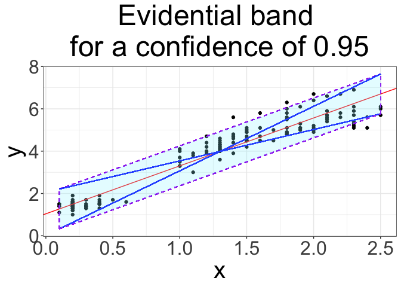
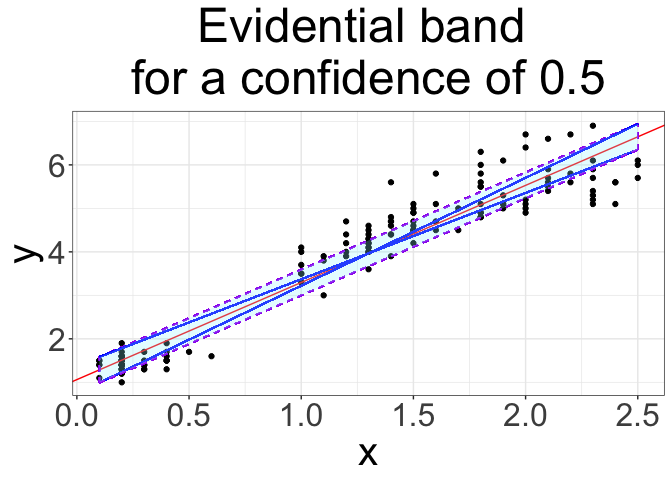
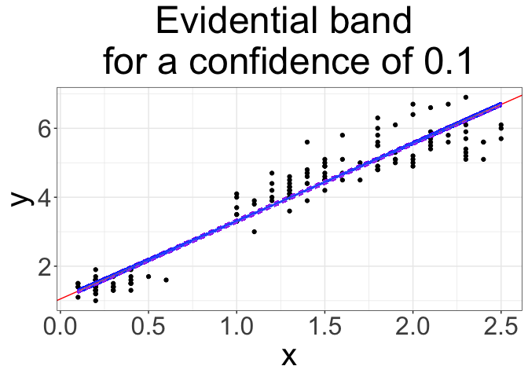
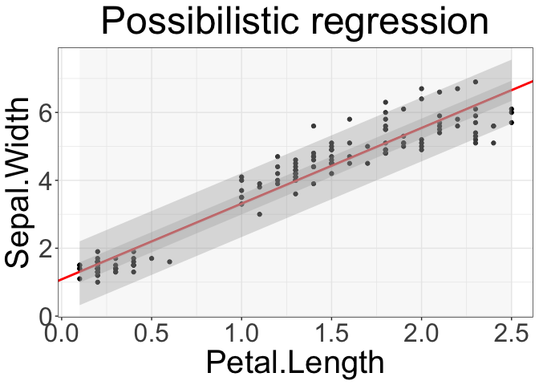

README
================
Nicolas Sutton-Charani & Francis Faux
2024-02-09

#### Data definition

``` r
df <- iris[c("Petal.Length", "Petal.Width")]
names(df) <- c("y", "x")
```

#### Possibilistic linear regression

``` r
devtools::source_url(paste0("https://raw.githubusercontent.com/sutton-charani/",
                            "possibilistic_linear_regression/",
                            "main/code/my_lib_possibilistic_linear_regression.R"),
                     sha1="701008dc6020d940d1fd11adce67f10d091378c3")
```

``` r
empirical_conf_int(df$x, df$y, confidence=0.95, do_plot=T)
```

    ## $intercept
    ## [1] 1.083558
    ## 
    ## $intercept_min
    ## [1] 0.09938528
    ## 
    ## $intercept_max
    ## [1] 1.980412
    ## 
    ## $slope
    ## [1] 2.22994
    ## 
    ## $slope_min
    ## [1] 1.481119
    ## 
    ## $slope_max
    ## [1] 3.048641
    ## 
    ## $plot

<!-- -->

``` r
empirical_conf_int(df$x, df$y, confidence=0.5, do_plot=T)
```

    ## $intercept
    ## [1] 1.083558
    ## 
    ## $intercept_min
    ## [1] 0.7648992
    ## 
    ## $intercept_max
    ## [1] 1.359801
    ## 
    ## $slope
    ## [1] 2.22994
    ## 
    ## $slope_min
    ## [1] 1.962976
    ## 
    ## $slope_max
    ## [1] 2.503796
    ## 
    ## $plot

<!-- -->

``` r
empirical_conf_int(df$x, df$y, confidence=0.1, do_plot=T)
```

    ## $intercept
    ## [1] 1.083558
    ## 
    ## $intercept_min
    ## [1] 1.001873
    ## 
    ## $intercept_max
    ## [1] 1.098947
    ## 
    ## $slope
    ## [1] 2.22994
    ## 
    ## $slope_min
    ## [1] 2.200346
    ## 
    ## $slope_max
    ## [1] 2.314551
    ## 
    ## $plot

<!-- -->

``` r
possibilistic_linear_regression(x=df$x, y=df$y, do_plot=T, confidences=c(0.1, 0.50, .95))
```

    ## $precise_slope
    ## [1] 2.22994
    ## 
    ## $precise_intercept
    ## [1] 1.083558
    ## 
    ## $slope_possibility
    ##   slope_min slope_max        mass
    ## 1  2.200346  2.314551 0.064237982
    ## 2  1.962976  2.503796 0.321189912
    ## 3  1.481119  3.048641 0.610260832
    ## 4      -Inf       Inf 0.006711409
    ## 
    ## $intercept_possibility
    ##   intercept_min intercept_max        mass
    ## 1    1.00187302      1.098947 0.064237982
    ## 2    0.76489920      1.359801 0.321189912
    ## 3    0.09938528      1.980412 0.610260832
    ## 4          -Inf           Inf 0.006711409
    ## 
    ## $plot

<!-- -->
