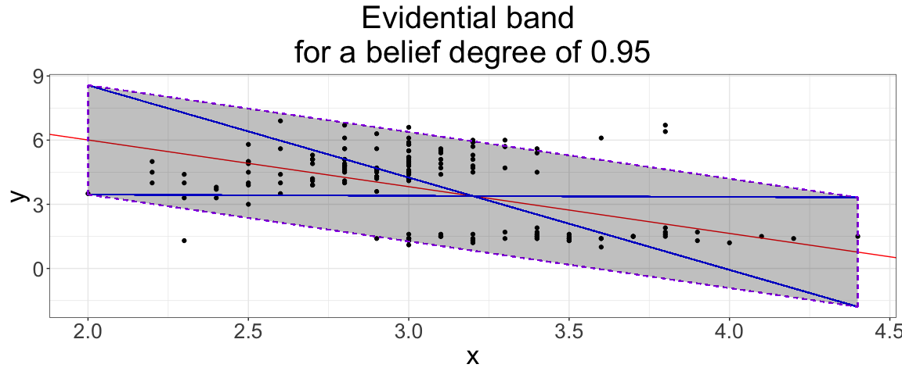
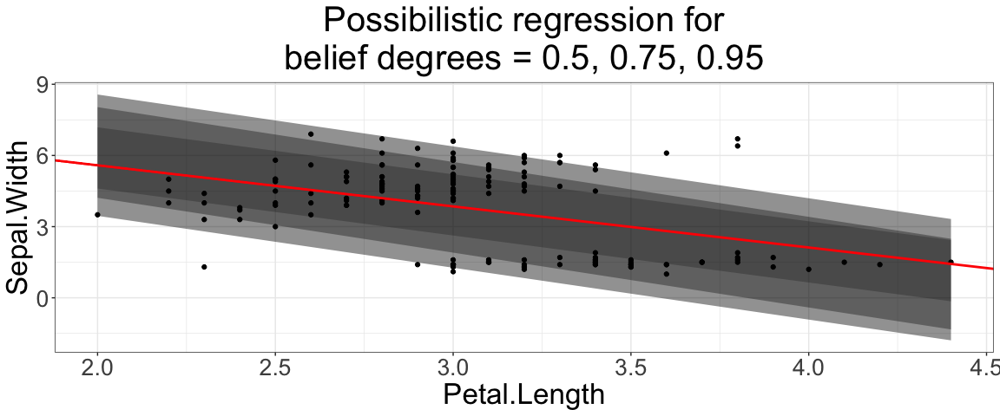
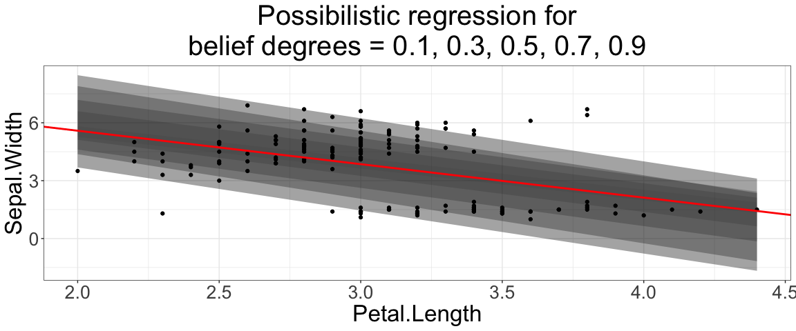
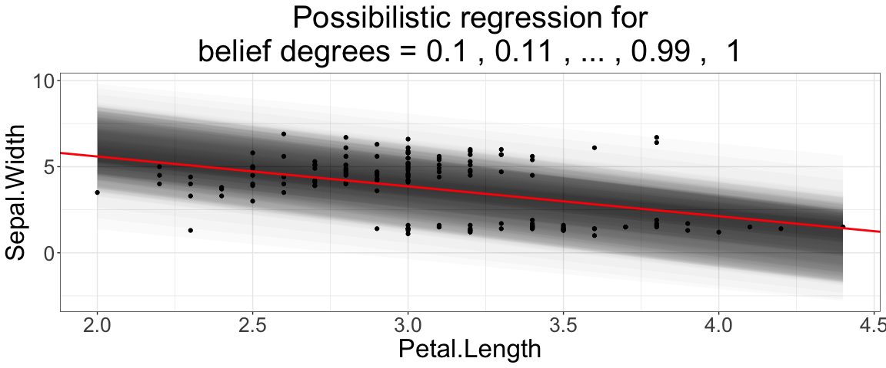
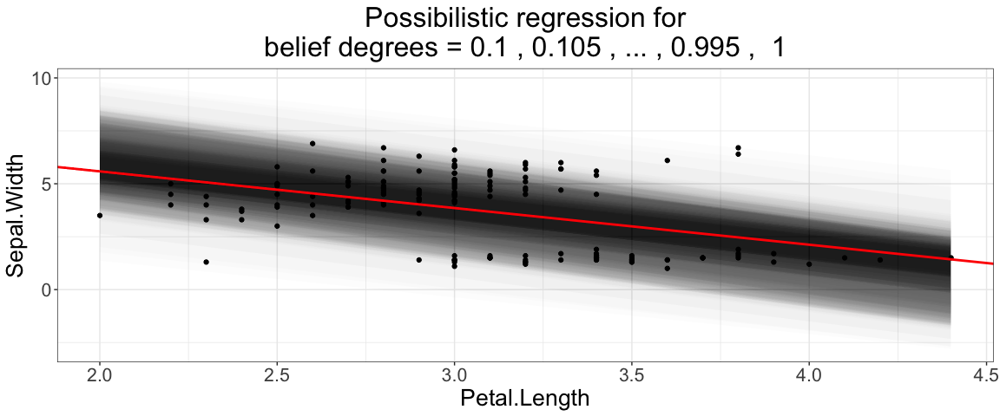

README
================
Nicolas Sutton-Charani & Francis Faux
2024-02-09

#### Data definition

``` r
df <- iris[c("Petal.Length", "Sepal.Width")]
names(df) <- c("y", "x")
```

#### Possibilistic linear regression

``` r
devtools::source_url(paste0("https://raw.githubusercontent.com/sutton-charani/",
                            "possibilistic_linear_regression/",
                            "main/code/my_lib_possibilistic_linear_regression.R"),
                     sha1="f29b7b3b89cc6974170ffc70865ea2135d443d5b")
```

``` r
empirical_conf_int(df$x, df$y, confidence=0.95, do_plot=T)
```

    ## $intercept
    ## [1] 10.38348
    ## 
    ## $intercept_min
    ## [1] 7.825994
    ## 
    ## $intercept_max
    ## [1] 12.94097
    ## 
    ## $slope
    ## [1] -2.18608
    ## 
    ## $slope_min
    ## [1] -4.317319
    ## 
    ## $slope_max
    ## [1] -0.0548418
    ## 
    ## $plot

<!-- -->

``` r
possibilistic_linear_regression(x=df$x, y=df$y, do_plot=T)
```

    ## $precise_slope
    ## [1] -1.735222
    ## 
    ## $precise_intercept
    ## [1] 9.063151
    ## 
    ## $slope_possibility
    ##   slope_min  slope_max        mass
    ## 1 -3.152883 -0.8082314 0.226581509
    ## 2 -4.048717 -0.5751864 0.339872263
    ## 3 -4.317319 -0.0548418 0.430504866
    ## 4      -Inf        Inf 0.006711409
    ## 
    ## $intercept_possibility
    ##   intercept_min intercept_max        mass
    ## 1      8.567402      11.14652 0.226581509
    ## 2      8.840232      12.66112 0.339872263
    ## 3      7.825994      12.94097 0.430504866
    ## 4          -Inf           Inf 0.006711409
    ## 
    ## $slope_confs
    ## [1] -1.980557 -2.311952 -2.186080
    ## 
    ## $plot

<!-- -->

``` r
possibilistic_linear_regression(x=df$x, y=df$y, do_plot=T, seq(from=0.1, to=1, by=0.2))
```

    ## $precise_slope
    ## [1] -1.735222
    ## 
    ## $precise_intercept
    ## [1] 9.063151
    ## 
    ## $slope_possibility
    ##   slope_min  slope_max        mass
    ## 1 -1.897085 -1.3915347 0.039892905
    ## 2 -2.542605 -1.1925795 0.119678715
    ## 3 -3.152883 -0.8082314 0.199464525
    ## 4 -3.913029 -0.7068524 0.279250335
    ## 5 -4.223340 -0.2407431 0.359036145
    ## 6      -Inf        Inf 0.006711409
    ## 
    ## $intercept_possibility
    ##   intercept_min intercept_max        mass
    ## 1      8.555053      9.111158 0.039892905
    ## 2      8.849810     10.334838 0.119678715
    ## 3      8.567402     11.146518 0.199464525
    ## 4      8.991794     12.518589 0.279250335
    ## 5      8.149591     12.928708 0.359036145
    ## 6          -Inf           Inf 0.006711409
    ## 
    ## $slope_confs
    ## [1] -1.644310 -1.867592 -1.980557 -2.309941 -2.232042
    ## 
    ## $plot

<!-- -->

``` r
possibilistic_linear_regression(x=df$x, y=df$y, do_plot=T, seq(from=0.1, to=1, by=0.01))$plot
```

<!-- -->

``` r
possibilistic_linear_regression(x=df$x, y=df$y, do_plot=T, seq(from=0.1, to=1, by=0.005), size=20)$plot
```

<!-- -->
