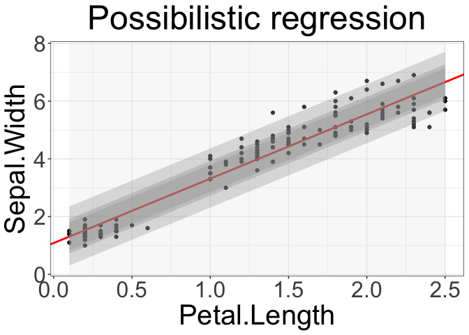
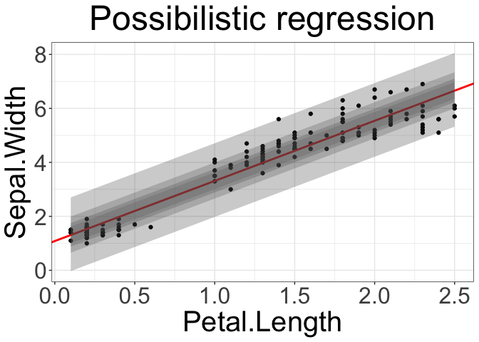

README
================
Nicolas Sutton-Charani
2024-02-09

## Data definition

``` r
df <- iris[c("Petal.Length", "Petal.Width")] # "Petal.Length", "Sepal.Length"
names(df) <- c("y", "x")
```

## Possibilistic linear regression

``` r
soft_lm <- possibilistic_linear_regression(x=df$x, y=df$y, do_plot=T)
```

    ## Warning: Using `size` aesthetic for lines was deprecated in ggplot2 3.4.0.
    ## ℹ Please use `linewidth` instead.
    ## This warning is displayed once every 8 hours.
    ## Call `lifecycle::last_lifecycle_warnings()` to see where this warning was
    ## generated.

    ## Warning in geom_abline(intercept = intercept, slope = slope, col = "red", :
    ## Ignoring unknown parameters: `xmin`

``` r
soft_lm
```

    ## $precise_slope
    ## [1] 2.22994
    ## 
    ## $precise_intercept
    ## [1] 1.083558
    ## 
    ## $slope_possibility
    ##   slope_min slope_max        mass
    ## 1  1.831824  2.628057 0.284933752
    ## 2  1.729451  2.730430 0.325638574
    ## 3  1.376834  3.083047 0.386695807
    ## 4      -Inf       Inf 0.006711409
    ## 
    ## $intercept_possibility
    ##   intercept_min intercept_max        mass
    ## 1    0.61616271      1.571642 0.284933752
    ## 2    0.49597534      1.697149 0.325638574
    ## 3    0.08199662      2.129452 0.386695807
    ## 4          -Inf           Inf 0.006711409
    ## 
    ## $plot

<!-- -->

``` r
soft_lm <- possibilistic_linear_regression(x=df$x, y=df$y, do_plot=T, confidences=seq(from=0.5, to=0.99, length.out=4))
```

    ## Warning in geom_abline(intercept = intercept, slope = slope, col = "red", :
    ## Ignoring unknown parameters: `xmin`

``` r
soft_lm
```

    ## $precise_slope
    ## [1] 2.22994
    ## 
    ## $precise_intercept
    ## [1] 1.083558
    ## 
    ## $slope_possibility
    ##   slope_min slope_max        mass
    ## 1  1.968321  2.491560 0.167408206
    ## 2  1.865948  2.593933 0.222094887
    ## 3  1.672578  2.787303 0.276781568
    ## 4  1.092465  3.367416 0.331468249
    ## 5      -Inf       Inf 0.006711409
    ## 
    ## $intercept_possibility
    ##   intercept_min intercept_max        mass
    ## 1     0.7764125      1.404299 0.167408206
    ## 2     0.6562252      1.529806 0.222094887
    ## 3     0.4292046      1.766875 0.276781568
    ## 4    -0.2518572      2.478083 0.331468249
    ## 5          -Inf           Inf 0.006711409
    ## 
    ## $plot

<!-- -->
